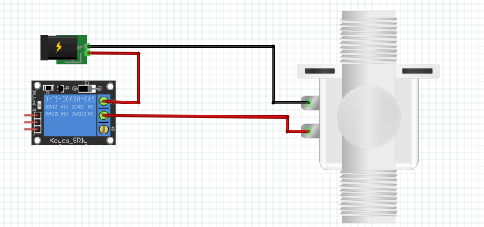
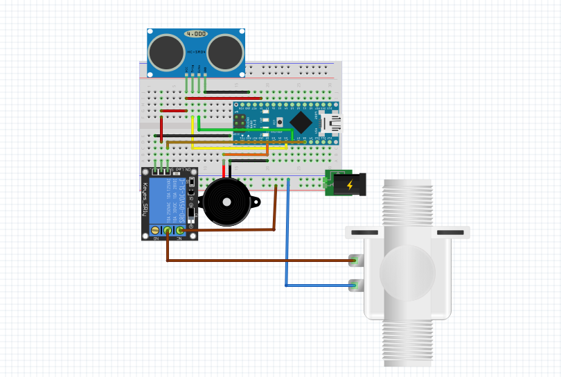
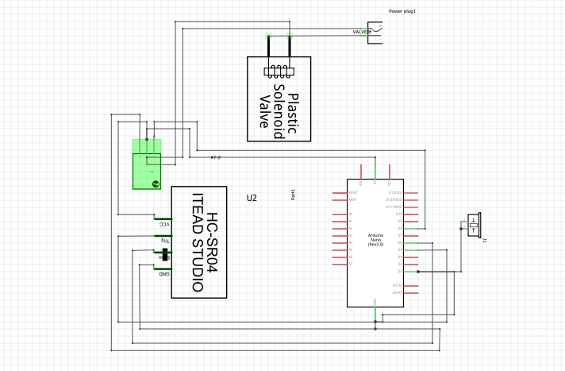
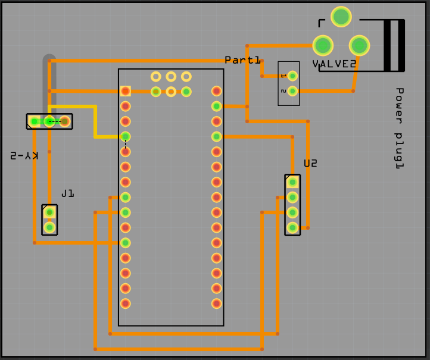

# Smart-Hand-washer-to-fight-Corona
Connection
<b> Ultrasonic |  Arduino Pro-mini</b> 
===============|====================== 
-------VCC---- |------5V  
-------GND ----|------GND  
-------Trig----|-------D5  
-------Echo----|-------D6 
 
<b>Buzzer | Ardurino Pro Mini</b> 
===================|============== 
-----GND ----------|------GND 
-----Cathode-------|------D2 
 
<b>Relay | Arduino pro mini</b> 
===================|============== 
---------vcc-------|-------5V------ 
---------GND-------|-------GND----- 
--------Signal-----|-------D8------- 

Selenoid valve to relay 
===================|============== 
Anode from power supply 12v to Anode of solenoid valve 
Cathode from power source gets into relay through one pin and from the other pin  
the cable proceeds to Selonoid valve as shown in the image below 
 
 
The following images shows how the project look like 
Breadboard image 
 
 
Schematic image 
 
 
pcb image  
 
  
Thank you. if any question reach me  
solomonkamau19@gmail.com 
+254710719728
